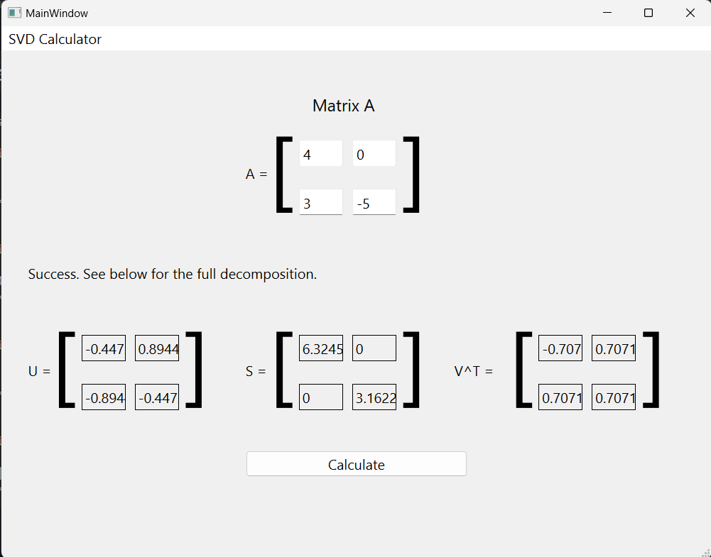

# mini-svd-calc

# Intro
SVD, known as singular value decomposition, is a concept in linear algebra where any matrix can be written into a product of three distinct matrices. You can read more about this topic [here](https://en.wikipedia.org/wiki/Singular_value_decomposition).

If you are interested in the GUI version, then check out the quick video [here](https://www.youtube.com/watch?v=O4KkF-eCpCI).

# Screenshots



# Description
This calculator computes the SVD of a 2x2 square matrix. The calculator takes a csv file of 2x2 matrices as input where each line/row consists of a 2x2 matrix in the following format a, b, c, d. The variables a, b, c, d represent double values and the delimiter "," denotes separation of entries. In indices form, a matrix is constructed as a = [0][0], b = [0][1], c = [1][0], and d = [1][1]. This is represented as [a b; c d] where the first row would be a and b. However, in this program, matrices will represented either as a 1-D vector or mostly a 2-D vector. The resulting SVD of that matrix is printed to the terminal.

Please note that there are now two versions of this program.

- Terminal: Reads csv files and generates an SVD of a matrix.

- GUI: Reads text input by the useer and generatees an SVD of a matrix.

See what best suits you by referring to the  ```section=Setup``` below.

# Contents
Let us denote what is included in this program.

```dir=csv```: contains data about 2x2 matrices

```dir=src```: contains files needed to run the terminal calculator

```dir=Qtsrc```: contains files needed to run the GUI

```README.md```: provides information about the calculator

```.gitignore```: *.o, *.exe, and any text editor/ide configuration files should not be included in this repository

Inside ```dir=src```:

```Makefile```: commands used to compile the files below

```blank.cpp```: tester file, irrelevant to running the calculator

```construct.h/cpp```: constructs the matrix

```helper.h/cpp```: provides printing of a vector (representing a row/column vector) and a 2D-vector (representing a matrix)

```input.h/cpp```: provides file input reading matrix data of csv files

```operation.h/cpp```: provides basic matrix operations in order to compute the SVD

```svd.cpp```: The main file to run and compute the svd of a matrix. All other files are included here.

```test.cpp```: For the owner of this repository to test out individual files and functions. This file is also irrelevant to running the calculator.

# Setup
Open a terminal. Clone/fork the repository or install all the directories/files denoted above. You may omit ```blank.cpp``` and ```test.cpp``` as those files are irrelevant to compiling and running the calculator. Compile commands are included in the Makefile and running ```make```. This will generate on Windows the executiable svd.exe. Please refer to ```dir=csv``` containing all the data for inputting 2x2 matrices. You can modify existing and/or creating new csv files. This will be used as a argument when running the svd.exe. Denote the path of a csv file in the ```dir=csv``` while being in src as ```../csv/<file-name.csv>```, if retaining the same directory structure. Now we can run the svd.exe file as ```./svd ../csv/\<file-name.csv\>``` to generate the SVD of an matrix.

Terminal:

1.  Open a terminal.

2.  Clone/fork the repository or install all the directories/files.

3.  Compile using ```make```.

4.  Run using ```./svd ../csv/\<file-name.csv\>``` where "\<file-name.csv> is the name of an csv file in ```dir=csv```.

*Please note a .dll issue or certain static libraries that are not found on Windows while running the svd.exe can be temporary fixed given a flag variable provided in the Makefile already as ```-static-libstdc++```.*

GUI:

1.  Download Qt.

2.  Download/copy the ```dir=Qt```.

3.  Create a new project by importing or copying the files.

4.  Click the green play button to auto build(compile) and run.

5.  Click on the textboxes near matrix A in order to type values for each entry and click ```calculate``` to see the results.

# Limitations

There some limitations to this calculator to be aware above. By SVD properties, every matrix can have an SVD, but for this calculator it is limited to 2x2 real matrices with distinct eigenvalues. What does this mean exactly?

A valid input matrix for this calculator:

- Has dimensions 2x2, thereby being square.

- Has real numbers for all entries.

- Has distinct eigenvalues, so they cannot be equal to each other.

*In short terms, this means that matrices which at least 2 entries that are equal to zero can potentially cause this issue.*

Such cases include: [0 0; 0 0], [k 0; 0 k], [0 k; 0 0], or [0 -1; 1 0] where k is a real number from 0 to inf.

This results in the calculator to output invalid responses.

*A more advanced online SVD calculator can be viewed [here](https://www.wolframalpha.com/input/?i=Singular+value+decomposition&a=).*

# Resources

Let us denote the resources used for making this calculator.

- VS Code

- g++ version: 13.2.0 by MSYS2 (UCRT64)

- c++ version: c++17

- Qt Creator 6.5.3

- Qt Design Studio 4.1.0 LTS